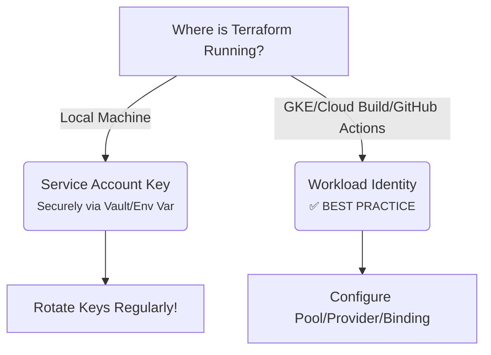

### **12.1 GCP Provider Configuration**  
*The foundational setup for *all* Terraform-GCP interactions.*

**What it is:**  
The `google` provider plugin connects Terraform to your GCP environment. It translates Terraform configurations into GCP API calls.

**Critical Configuration Elements:**
```hcl
terraform {
  required_providers {
    google = {
      source  = "hashicorp/google"
      version = ">= 5.0.0" // ALWAYS pin versions!
    }
  }
}

provider "google" {
  project     = "your-project-id" // Mandatory
  region      = "us-central1"     // Default region (can override per-resource)
  zone        = "us-central1-a"   // Default zone (less common now; regions preferred)
  credentials = file("account.json") // Path to service account key (see 12.2)
  
  // Advanced (but crucial):
  user_project_override = true // Required for Shared VPC scenarios
  request_timeout       = "60s" // Default is 30s; increase for slow operations
  scopes = [
    "https://www.googleapis.com/auth/cloud-platform"
  ]
}
```

**Key Nuances:**
1.  **Version Pinning:** GCP provider updates *frequently* break things. **Always** specify `version = "~> 5.30.0"` (use latest minor within major).
2.  **Region vs. Zone:** Modern GCP favors *regions* (e.g., `us-central1`). Zones (e.g., `us-central1-a`) are for zonal resources. Provider defaults apply unless overridden per-resource.
3.  **Shared VPC:** If using Shared VPC (host project + service projects), `user_project_override = true` is **mandatory**. Otherwise, Terraform uses the service project's quota, not the host project's.
4.  **Provider Aliases:** For multi-project setups (e.g., networking in host project, apps in service project):
    ```hcl
    provider "google" {
      alias   = "host"
      project = "host-project-id"
    }
    provider "google" {
      alias   = "service"
      project = "service-project-id"
    }
    resource "google_compute_network" "vpc" {
      provider = google.host
      # ...
    }
    ```
5.  **Impersonation:** Use `impersonate_service_account` to delegate to another SA (requires `roles/iam.serviceAccountTokenCreator`):
    ```hcl
    provider "google" {
      impersonate_service_account = "impersonated-sa@project.iam.gserviceaccount.com"
    }
    ```

**Why it matters:** Misconfiguration here breaks *everything*. This is your Terraform "session" to GCP.

---

### **12.2 Authentication (Service Account Key, Workload Identity)**  
*How Terraform proves its identity to GCP. **Security-critical!***

#### **A. Service Account Key File (Simpler, but Risky)**
*   **How it works:**
    1.  Create a GCP Service Account (SA) in IAM & Admin.
    2.  Grant it **least-privilege roles** (e.g., `roles/compute.admin`, `roles/storage.admin`).
    3.  Generate a **JSON Key File** (`gcloud iam service-accounts keys create account.json --iam-account=terraform@project.iam.gserviceaccount.com`).
    4.  Reference in provider: `credentials = file("account.json")`.
*   **Critical Gotchas:**
    *   **NEVER commit `account.json` to Git!** Use `.gitignore`. Use secrets management (Vault, GCP Secret Manager) or CI/CD secrets.
    *   **Rotate keys regularly!** Old keys linger; revoke unused ones.
    *   **Least Privilege:** Overly permissive SAs = catastrophic blast radius. Start minimal, add only needed roles.
*   **When to use:** Local development, simple CI/CD pipelines where Workload Identity isn't feasible.

#### **B. Workload Identity Federation (Modern, Secure, Preferred)**
*   **How it works:** Terraform (running on GCE, GKE, Cloud Build, GitHub Actions, etc.) *impersonates* a GCP SA using the *host platform's* identity. **No key files!**
*   **Setup Steps:**
    1.  **Create GCP SA:** `terraform@project.iam.gserviceaccount.com` (with necessary roles).
    2.  **Create Workload Identity Pool:** `gcloud iam workload-identity-pools create "terraform-pool" --project=project-id`
    3.  **Create Provider (e.g., GitHub):** `gcloud iam workload-identity-pools providers create-oidc "github-provider" --issuer-uri="https://token.actions.githubusercontent.com" --allowed-audiences="https://github.com/your-org" --attribute-mapping="google.subject=assertion.sub,attribute.actor=assertion.actor,attribute.repository=assertion.repository"`
    4.  **Allow Pool to Impersonate SA:**
        ```bash
        gcloud iam service-accounts add-iam-policy-binding \
          terraform@project.iam.gserviceaccount.com \
          --role="roles/iam.workloadIdentityUser" \
          --member="principalSet://iam.googleapis.com/projects/PROJECT_NUMBER/locations/global/workloadIdentityPools/terraform-pool/*"
        ```
    5.  **Terraform Provider Config (in CI/CD):**
        ```hcl
        provider "google" {
          project     = "project-id"
          region      = "us-central1"
          impersonate_service_account = "terraform@project.iam.gserviceaccount.com"
        }
        ```
    6.  **CI/CD Setup (GitHub Actions Example):**
        ```yaml
        - name: Configure Workload Identity
          uses: google-github-actions/auth@v1
          with:
            workload_identity_provider: "projects/PROJECT_NUMBER/locations/global/workloadIdentityPools/terraform-pool/providers/github-provider"
            service_account: "terraform@project.iam.gserviceaccount.com"
        - run: terraform apply
        ```
*   **Why it's Superior:**
    *   **No Secrets:** Zero key files to manage/rotate/leak.
    *   **Auditable:** Every action logged with precise CI/CD context (repo, commit, actor).
    *   **Short-Lived Tokens:** Tokens expire quickly (1hr default).
    *   **Fine-Grained Trust:** Restrict *which* repos/jobs can impersonate the SA.
*   **When to use:** **ALWAYS prefer this for production CI/CD.** Essential for GKE, Cloud Build, GitHub Actions, etc.

**Authentication Decision Flow:**


---

### **12.3 VPC, Subnetworks, Firewalls**  
*Building the secure network foundation.*

#### **Core Resources & Best Practices**
```hcl
# 1. VPC Network (Global)
resource "google_compute_network" "vpc" {
  name                    = "main-vpc"
  auto_create_subnetworks = false // CRITICAL: Disable default subnets!
  routing_mode            = "GLOBAL" // REGIONAL is legacy
  mtu                     = 1460   // Standard for GCP
  delete_default_routes   = true   // Security hardening
}

# 2. Subnetworks (Regional)
resource "google_compute_subnetwork" "private" {
  name          = "private-subnet"
  ip_cidr_range = "10.0.1.0/24"
  region        = "us-central1"
  network       = google_compute_network.vpc.id
  private_ip_google_access = true // Allow VMs to reach Google APIs without NAT
  purpose       = "PRIVATE"      // For Private Service Connect
  role          = "ACTIVE"       // For Regional Internal Load Balancers

  // Enable Flow Logs (Security/Debugging)
  log_config {
    aggregation_interval = "INTERVAL_5_SEC"
    flow_sampling        = 0.5
    metadata             = "INCLUDE_ALL_METADATA"
  }
}

# 3. Firewall Rules (Stateful, applied to VPC)
resource "google_compute_firewall" "allow_http" {
  name    = "allow-http-ingress"
  network = google_compute_network.vpc.name

  // Target specific SAs or tags (NOT IPs!)
  target_service_accounts = [google_service_account.web.id] // ✅ BEST PRACTICE
  # target_tags = ["http-server"] // Legacy, less secure

  allow {
    protocol = "tcp"
    ports    = ["80", "443"]
  }

  // Restrict sources (NEVER "0.0.0.0/0" for sensitive ports!)
  source_ranges = ["35.235.240.0/20"] // GCP Load Balancer IPs
}
```

**Deep Dive Concepts:**
*   **`auto_create_subnetworks = false`:** **MANDATORY.** Default subnets are wide open (`0.0.0.0/0` ingress). You *must* define your own secure subnets.
*   **Private Google Access:** `private_ip_google_access = true` on subnets is essential for VMs without public IPs to access Google APIs/services (e.g., Cloud Storage, Secret Manager).
*   **Firewall Targeting:**
    *   **✅ Target Service Accounts:** Most secure method. Only VMs running as *this specific SA* get the rule.
    *   **⚠️ Target Tags:** Legacy. Less secure (tags can be added by VM owner). Use only if SAs aren't feasible.
    *   **❌ Target IPs:** Avoid. Use source_ranges/source_tags instead.
*   **Statefulness:** GCP firewalls are *stateful*. If you allow `TCP:80` ingress, the `ESTABLISHED` egress response is automatically allowed.
*   **Egress Rules:** Often overlooked! Default egress is `0.0.0.0/0`. Restrict to specific IPs/ports for security:
    ```hcl
    resource "google_compute_firewall" "restrict_egress" {
      direction = "EGRESS"
      allow {
        protocol = "tcp"
        ports    = ["443"]
      }
      destination_ranges = ["0.0.0.0/0"] // But restrict ports!
      # ... plus target_service_accounts
    }
    ```
*   **Shared VPC:** Host project defines VPC/Subnets. Service projects attach via:
    ```hcl
    resource "google_compute_shared_vpc_service_project" "attach" {
      host_project    = "host-project-id"
      service_project = "service-project-id"
    }
    // Then use subnets in service project config:
    resource "google_compute_instance" "vm" {
      zone           = "us-central1-a"
      machine_type   = "e2-medium"
      can_ip_forward = false
      boot_disk { ... }
      network_interface {
        subnetwork = "projects/host-project-id/regions/us-central1/subnetworks/private-subnet"
      }
    }
    ```

---

### **12.4 Compute Engine (VMs)**  
*Provisioning and managing virtual machines.*

```hcl
resource "google_service_account" "vm" {
  account_id   = "vm-sa"
  display_name = "VM Service Account"
}

resource "google_compute_instance" "web" {
  name         = "web-server"
  machine_type = "e2-medium"
  zone         = "us-central1-a" // Override provider default

  boot_disk {
    initialize_params {
      image  = "projects/debian-cloud/global/images/debian-11-bullseye-v20231010"
      size   = 50
      type   = "pd-balanced" // pd-ssd, pd-standard
      labels = { env = "prod" }
    }
  }

  network_interface {
    network    = google_compute_network.vpc.name
    subnetwork = google_compute_subnetwork.private.name
    # Access Config = Public IP (Avoid if possible!)
    # access_config {} 
  }

  service_account {
    email  = google_service_account.vm.email
    scopes = ["cloud-platform"] // Inherit SA roles; avoid broad scopes!
  }

  metadata = {
    ssh-keys     = "user:${file("~/.ssh/id_rsa.pub")}" // Not best practice!
    startup-script = file("startup.sh") // ✅ Preferred for config
  }

  labels = {
    role = "web"
  }

  // Prevent accidental deletion
  prevent_destroy = true 
}
```

**Critical Details:**
1.  **Service Accounts > Scopes:** Assign minimal IAM roles to the SA (`roles/logging.logWriter`, `roles/monitoring.metricWriter`). Avoid `cloud-platform` scope unless absolutely needed (overly permissive).
2.  **Public IPs:** **Avoid `access_config`** (public IP) unless necessary. Use Identity-Aware Proxy (IAP) Tunneling or bastion hosts for SSH/RDP:
    ```hcl
    resource "google_compute_firewall" "allow_iap_ssh" {
      target_tags    = ["iap-ssh"]
      allow {
        protocol = "tcp"
        ports    = ["22"]
      }
      source_ranges = ["35.235.240.0/20"] // IAP IPs
    }
    # Then tag your instance with "iap-ssh"
    ```
3.  **Metadata:**
    *   **`ssh-keys`:** Insecure (rotates keys poorly). Use IAP or OS Login (`enable-oslogin=TRUE` metadata).
    *   **`startup-script`:** **BEST PRACTICE.** Use for bootstrapping (install apps, fetch configs). Keep it idempotent.
4.  **Disk Types:** `pd-balanced` (best cost/perf), `pd-ssd` (high perf), `pd-standard` (legacy, slow). **Always set `size`** (default 10GB is too small).
5.  **Labels & Tags:** Essential for organization, cost allocation, and firewall targeting. Use consistent schema (`env=prod`, `app=web`).
6.  **Prevent Destroy:** Use `prevent_destroy = true` on critical prod VMs to avoid accidental `terraform destroy`.
7.  **Instance Templates & Managed Instance Groups (MIGs):** For scalable, resilient apps (beyond basic VMs):
    ```hcl
    resource "google_compute_instance_template" "web" { ... }
    resource "google_compute_region_instance_group_manager" "web" {
      base_instance_name = "web"
      region             = "us-central1"
      target_size        = 3
      instance_template  = google_compute_instance_template.web.self_link
      // Auto-healing, named ports, etc.
    }
    ```

---

### **12.5 Cloud SQL & Cloud Storage**  
*Managed databases and object storage.*

#### **Cloud SQL (PostgreSQL Example)**
```hcl
resource "google_sql_database_instance" "main" {
  name             = "prod-db"
  database_version = "POSTGRES_15"
  region           = "us-central1"

  settings {
    tier = "db-custom-2-7680" // 2 vCPU, 7.5GB RAM

    backup_configuration {
      enabled    = true
      start_time = "05:00" // UTC
    }

    ip_configuration {
      ipv4_enabled    = false // Disable public IP!
      private_network = google_service_networking_connection.vpc_network.network // Use Private Service Connect
    }

    // Security hardening
    database_flags {
      name  = "log_min_duration_statement"
      value = "500"
    }
  }

  // Encryption (KMS)
  settings {
    disk_encryption_key_name = google_kms_crypto_key.db-key.id
  }
}

resource "google_sql_database" "app_db" {
  name     = "app_data"
  instance = google_sql_database_instance.main.name
}

resource "google_sql_user" "app_user" {
  name     = "app_user"
  instance = google_sql_database_instance.main.name
  password = random_password.app_password.result // Use Vault for prod!
}
```

**Cloud SQL Deep Dive:**
*   **Private IP Only:** **ALWAYS** use `private_network` with `google_service_networking_connection` (see below). Public IPs are a major attack vector.
*   **Private Service Connect Setup (Mandatory for Private IP):**
    ```hcl
    resource "google_service_networking_connection" "vpc_network" {
      network                 = google_compute_network.vpc.id
      service                 = "servicenetworking.googleapis.com"
      reserved_peering_ranges = [google_compute_global_address.sql-range.name]
    }

    resource "google_compute_global_address" "sql-range" {
      name          = "sql-range"
      address_type  = "INTERNAL"
      purpose       = "VPC_PEERING"
      prefix_length = 16
      network       = google_compute_network.vpc.id
    }
    ```
*   **High Availability:** For production, use `settings { availability_type = "REGIONAL" }` (multi-zonal).
*   **Backup Configuration:** Enable backups! Set `retained_backups` and `binary_log_Enabled` for point-in-time recovery.
*   **KMS Encryption:** Encrypt data at rest with customer-managed keys (CMK) via KMS.
*   **Users & Passwords:** **NEVER hardcode passwords.** Use `random_password` + Vault or `google_sql_user` with secrets from Vault/Secret Manager.

#### **Cloud Storage (GCS)**
```hcl
resource "google_storage_bucket" "assets" {
  name          = "acme-prod-assets-bucket"
  location      = "US" // Multi-region
  storage_class = "STANDARD"

  uniform_bucket_level_access = true // ✅ BEST PRACTICE (simpler IAM)

  lifecycle_rule {
    action {
      type = "Delete"
    }
    condition {
      age = 30 // Days
    }
  }

  versioning {
    enabled = true
  }

  // CORS Configuration (for web apps)
  cors {
    origin          = ["https://www.example.com"]
    method          = ["GET", "HEAD"]
    response_header = ["Content-Type"]
    max_age_seconds = 3600
  }
}

// Fine-grained IAM (if not using uniform access)
resource "google_storage_bucket_iam_member" "viewer" {
  bucket = google_storage_bucket.assets.name
  role   = "roles/storage.objectViewer"
  member = "serviceAccount:app-sa@project.iam.gserviceaccount.com"
}
```

**GCS Deep Dive:**
*   **Uniform Bucket-Level Access (UBLA):** **ENABLE IT.** Replaces ACLs with standard IAM. Simpler, more secure, required for object versioning + retention policies.
*   **Location vs. Storage Class:**
    *   `location`: Physical region/multi-region (`US`, `EU`, `asia-southeast1`).
    *   `storage_class`: `STANDARD` (frequent access), `NEARLINE` (infrequent), `COLDLINE` (archival), `ARCHIVE` (long-term).
*   **Object Versioning:** Crucial for accidental deletion recovery. Combined with retention policies (`retention_policy { retention_period = 31536000 }`).
*   **Lifecycle Rules:** Automate cost savings (move to cheaper storage/delete old objects).
*   **CORS:** Required for browser-based uploads/downloads to work from specific domains.
*   **Encryption:** Default is Google-managed keys (GMEK). Use Customer-Managed Encryption Keys (CMEK) via KMS for stricter control:
    ```hcl
    resource "google_kms_key_ring" "gcs" { ... }
    resource "google_kms_crypto_key" "gcs-key" { ... }
    resource "google_storage_bucket" "secure" {
      encryption {
        default_kms_key_name = google_kms_crypto_key.gcs-key.id
      }
    }
    ```

---

### **12.6 Kubernetes Engine (GKE)**  
*Provisioning and managing GKE clusters.*

```hcl
resource "google_container_cluster" "primary" {
  name     = "prod-cluster"
  location = "us-central1" // Regional cluster

  # Essential Security Hardening
  remove_default_node_pool = true
  initial_node_count       = 1

  network    = google_compute_network.vpc.name
  subnetwork = google_compute_subnetwork.private.name

  ip_allocation_policy { // Use VPC-native (Alias IPs)
    cluster_secondary_range_name  = "pod-range"
    services_secondary_range_name = "svc-range"
  }

  private_cluster_config {
    enable_private_nodes    = true
    enable_private_endpoint = false // Disable if using IAP/ALB
    master_ipv4_cidr_block  = "172.16.0.0/28"
  }

  master_authorized_networks_config { // Restrict API server access
    cidr_blocks {
      cidr_block   = "34.96.0.0/16" // IAP ingress
      display_name = "IAP"
    }
  }

  release_channel {
    channel = "STABLE" // RAPID, REGULAR, STABLE
  }

  workload_identity_config { // ✅ BEST PRACTICE for pod IAM
    workload_pool = "${var.project_id}.svc.id.goog"
  }

  // Network Policy (Calico)
  network_policy {
    enabled = true
  }

  // Shielded Nodes
  node_config {
    shielded_instance_config {
      enable_secure_boot = true
    }
    gcfs_config {
      enabled = true // Google Filestore CSI driver
    }
  }
}

# VPC-native requires secondary IP ranges
resource "google_compute_subnetwork" "private" {
  # ... existing config ...
  ip_cidr_range      = "10.0.1.0/24"
  secondary_ip_range = [
    {
      range_name    = "pod-range"
      ip_cidr_range = "10.4.0.0/17"
    },
    {
      range_name    = "svc-range"
      ip_cidr_range = "10.0.32.0/20"
    }
  ]
}

# Add a Node Pool (Separate from cluster resource)
resource "google_container_node_pool" "primary" {
  name       = "default-pool"
  location   = "us-central1"
  cluster    = google_container_cluster.primary.name
  node_count = 3

  node_config {
    machine_type = "e2-medium"
    oauth_scopes = [
      "https://www.googleapis.com/auth/cloud-platform" // Avoid! Use Workload Identity
    ]
    service_account = google_service_account.gke-node.email
    metadata = {
      disable-legacy-endpoints = "true"
    }
    shielded_instance_config {
      enable_integrity_monitoring = true
    }
  }
}
```

**GKE Deep Dive:**
1.  **Regional Clusters:** `location = "us-central1"` (not a zone) creates 3 control plane replicas across zones. **Mandatory for production.**
2.  **VPC-Native (Alias IPs):** **NON-NEGOTIABLE.** Uses secondary IP ranges for pods/services. Avoids NAT, enables network policies, required for Network Endpoint Groups (NEG).
3.  **Private Cluster:**
    *   `enable_private_nodes = true`: Nodes have *only* private IPs.
    *   `master_ipv4_cidr_block`: IP range for control plane (must not overlap VPC).
    *   **Access:** Use IAP App Engine Tunnel or Cloud NAT + Bastion for `kubectl`.
4.  **Master Authorized Networks:** Restrict `kubectl` access to specific IPs (IAP, CI/CD, bastion). **Never leave open!**
5.  **Workload Identity:** **THE ONLY SECURE WAY** for pods to access GCP APIs.
    *   Annotate Kubernetes Service Account (KSA): `iam.gke.io/gcp-service-account: gke-pod-sa@project.iam.gserviceaccount.com`
    *   Bind GCP SA to KSA: `gcloud iam service-accounts add-iam-policy-binding gke-pod-sa@... --role roles/iam.workloadIdentityUser --member "serviceAccount:project-id.svc.id.goog[my-namespace/my-k8s-sa]"`
    *   Pod uses KSA; GKE exchanges token for GCP SA token.
6.  **Node Pools:** **ALWAYS** separate `google_container_node_pool` from cluster. Allows independent scaling/upgrades. Use multiple pools for different workloads (e.g., GPU pool).
7.  **Shielded Nodes:** `enable_secure_boot`, `enable_integrity_monitoring` protect against boot-level malware.
8.  **Release Channels:** `STABLE` for production. `REGULAR` for newer features with moderate testing. Avoid `RAPID` for prod.
9.  **Network Policies:** Enable Calico (`network_policy { enabled = true }`) for pod-to-pod firewalling (like Kubernetes NetworkPolicy).
10. **Avoid `oauth_scopes`:** Workload Identity replaces node-level scopes. Node scopes grant *all pods* excessive permissions.

---

### **12.7 Cloud Functions & Cloud Run**  
*Serverless execution environments.*

#### **Cloud Functions (v2 - Event-Driven)**
```hcl
resource "google_storage_bucket" "function_source" {
  name     = "function-source-bucket"
  location = "US"
}

resource "google_storage_bucket_object" "function_zip" {
  name   = "function.zip"
  bucket = google_storage_bucket.function_source.name
  source = "function.zip" // Your code zip
}

resource "google_cloudfunctions2_function" "hello" {
  name     = "hello-function"
  location = "us-central1"

  build_config {
    runtime = "nodejs18"
    entry_point = "helloHttp"
    source {
      storage_source {
        bucket = google_storage_bucket.function_source.name
        object = google_storage_bucket_object.function_zip.name
      }
    }
  }

  service_config {
    max_instance_count = 3
    available_memory   = "256M"
    timeout_sec        = 60

    // Security: Use SA with minimal permissions
    service_account_email = google_service_account.function.email

    // Ingress Control (Security!)
    ingress_settings = "ALLOW_INTERNAL_ONLY" // Or ALLOW_ALL

    // VPC Connector (for accessing private networks)
    # vpc_connector = "projects/project-id/locations/us-central1/connectors/my-connector"
  }

  event_trigger {
    trigger_region = "us-central1"
    event_type     = "google.cloud.storage.object.v1.finalized"
    service_account_email = google_service_account.function.email
    pubsub_topic = "projects/project-id/topics/gcf-generic"
    parameters = {
      bucket = google_storage_bucket.function_source.name
    }
  }
}
```

**Cloud Functions Deep Dive:**
*   **v1 vs v2:** **ALWAYS use v2 (`google_cloudfunctions2_function`)**. Based on GKE, better performance, networking, and triggers.
*   **Source Code:** Store zip in GCS bucket (managed by Terraform). *Do not* use inline code for production.
*   **Ingress Settings:** `ALLOW_INTERNAL_ONLY` blocks public access. Use API Gateway or IAP for controlled access.
*   **VPC Connector:** Required to access resources in your VPC (Cloud SQL, internal HTTP services). Creates a Serverless VPC Access connector:
    ```hcl
    resource "google_vpc_access_connector" "function_connector" {
      name          = "function-connector"
      subnet {
        name = "serverless-subnet"
      }
      machine_type = "e2-micro"
      min_instances = 2
    }
    ```
*   **Event Triggers:** Supports Pub/Sub, Cloud Storage, Firestore, HTTP (via `https_trigger`), Scheduler. Configure permissions carefully.
*   **Cold Starts:** Mitigate with `min_instance_count` (v2 only) or connecting to VPC (adds latency).

#### **Cloud Run (Container-Based Serverless)**
```hcl
resource "google_cloud_run_service" "backend" {
  name     = "backend-service"
  location = "us-central1"

  template {
    spec {
      containers {
        image = "gcr.io/project-id/backend:latest"
        resources {
          limits = {
            memory = "512Mi"
            cpu    = "1000m"
          }
        }
        env {
          name  = "DB_HOST"
          value = google_sql_database_instance.main.public_ip_address
        }
      }
      service_account_name = google_service_account.run.email
    }

    metadata {
      annotations = {
        "autoscaling.knative.dev/minScale" = "1" // Prevent cold starts
      }
    }
  }

  traffic {
    percent         = 100
    latest_revision = true
  }

  // Security: Only allow internal traffic
  metadata {
    annotations = {
      "run.googleapis.com/ingress" = "internal-and-cloud-load-balancing"
    }
  }
}

// IAM for Cloud Run (who can invoke?)
resource "google_cloud_run_service_iam_member" "invoker" {
  service  = google_cloud_run_service.backend.name
  location = "us-central1"
  role     = "roles/run.invoker"
  member   = "serviceAccount:api-gateway-sa@project.iam.gserviceaccount.com"
}
```

**Cloud Run Deep Dive:**
*   **Container First:** Requires a container image (in GCR/Artifact Registry). Terraform *deploys* the image; doesn't build it.
*   **Ingress Control:** Critical security setting via `metadata.annotations["run.googleapis.com/ingress"]`:
    *   `all`: Public (default - **avoid!**)
    *   `internal-only`: Only VPC resources
    *   `internal-and-cloud-load-balancing`: Only internal + GCP Load Balancers
*   **IAM for Invocation:** Use `google_cloud_run_service_iam_member` to control *who* can call the service (`roles/run.invoker`). Restrict to specific SAs (e.g., API Gateway SA).
*   **Min Scale:** `autoscaling.knative.dev/minScale = "1"` keeps 1 instance warm to eliminate cold starts (costs more).
*   **VPC Access:** Uses the same Serverless VPC Access connector as Cloud Functions to reach private networks.
*   **Concurrency:** Configure `container.concurrency` (default 80) to control how many requests per instance.
*   **Secrets:** Inject secrets via environment variables using **Secret Manager** (not hardcoded!):
    ```hcl
    env {
      name = "DB_PASSWORD"
      value_from {
        secret_key_ref {
          name = google_secret_manager_secret_version.db_password.secret.name
          key  = "latest"
        }
      }
    }
    ```

---

### **12.8 Using Google Data Sources**  
*Querying existing GCP resources for dynamic configuration.*

**Why Data Sources Matter:** They let Terraform *read* existing GCP state, enabling dynamic references without hardcoding IDs.

#### **Essential Data Sources & Patterns**

```hcl
# 1. Get Project ID (Avoid hardcoding!)
data "google_project" "current" {}

# 2. Get Network/Subnet Info (e.g., for GKE)
data "google_compute_network" "default" {
  name = "default-network"
}

data "google_compute_subnetwork" "private" {
  name   = "private-subnet"
  region = "us-central1"
}

# 3. Get Latest Stable Image (Safe VM deployments)
data "google_compute_image" "debian" {
  family  = "debian-11"
  project = "debian-cloud"
}

# 4. Get GKE Master Version (for cluster upgrades)
data "google_container_engine_versions" "central1" {
  location = "us-central1"
}
resource "google_container_cluster" "cluster" {
  min_master_version = data.google_container_engine_versions.central1.latest_master_version
  # ...
}

# 5. Get IAM Policy for a Resource (Modify incrementally)
data "google_iam_policy" "no_role" {
  binding {
    role = "roles/viewer"
    members = [
      "serviceAccount:${google_service_account.default.email}",
    ]
  }
}
resource "google_storage_bucket_iam_policy" "bucket" {
  bucket = "my-bucket"
  policy_data = data.google_iam_policy.no_role.policy_data
}

# 6. Get Subnetwork IP Ranges (For VPC-native GKE)
data "google_compute_subnetwork" "gke_subnet" {
  name   = "gke-subnet"
  region = "us-central1"
}
resource "google_container_cluster" "cluster" {
  ip_allocation_policy {
    cluster_secondary_range_name  = data.google_compute_subnetwork.gke_subnet.secondary_ip_range[0].range_name
    services_secondary_range_name = data.google_compute_subnetwork.gke_subnet.secondary_ip_range[1].range_name
  }
}
```

**Critical Best Practices:**
1.  **Avoid Hardcoding IDs:** Never write `"us-central1-a"` or `"prod-vpc"`. Use data sources to fetch them dynamically.
2.  **Dependency Management:** Data sources **do not** create dependencies by default. Use `depends_on` if the resource *must* exist first:
    ```hcl
    data "google_compute_subnetwork" "private" {
      name   = "private-subnet"
      region = "us-central1"
      depends_on = [google_compute_subnetwork.private] // Wait for subnet creation
    }
    ```
3.  **Stable Inputs:** Data sources require inputs that exist *before* Terraform runs (e.g., `name` of a pre-existing VPC). Don't use data sources to read resources *created in the same config* unless using `depends_on` (rare).
4.  **IAM Policy Data Sources:** Crucial for safe IAM updates. Use `google_iam_policy` data source to define *only the bindings you manage*, then apply with `*_iam_binding` or `*_iam_policy`.
5.  **Image Families:** Always use `data "google_compute_image"` with `family` (e.g., `debian-11`) instead of hardcoded image names for VMs. Ensures latest patched OS.
6.  **GKE Versioning:** `google_container_engine_versions` prevents cluster creation failures due to invalid versions. Use `latest_master_version` or pin to a specific `valid_master_versions[0]`.
7.  **Error Handling:** Data sources fail if the resource doesn't exist. Use `count` or `for_each` with `try()` for optional resources (advanced):
    ```hcl
    data "google_compute_subnetwork" "optional" {
      count = var.create_subnetwork ? 1 : 0
      name  = "optional-subnet"
      region = "us-central1"
    }
    ```

**When NOT to Use Data Sources:**
*   Reading resources created *in the same Terraform apply* (use resource references like `google_compute_network.vpc.id` instead).
*   For highly dynamic values that change frequently (can cause unnecessary diffs).

---

### **Key Cross-Cutting Principles (The Unwritten Rules)**
1.  **Least Privilege:** Every Service Account (Terraform, VMs, GKE pods) gets *only* the permissions it needs. Start minimal.
2.  **No Secrets in Code:** **NEVER** commit passwords, keys, or sensitive config. Use Vault, GCP Secret Manager, or CI/CD secrets.
3.  **Immutable Infrastructure:** Prefer replacing resources (new VM, new instance group) over in-place changes. Terraform excels at this.
4.  **State Management:** **ALWAYS** use remote state (GCS bucket + state locking via Cloud Storage). Never `terraform.tfstate` in Git.
5.  **Modularize:** Break configs into modules (`modules/network/`, `modules/gke/`). Reuse with inputs/outputs.
6.  **Validation:** Use `pre-commit` hooks with `tflint` and `tfsec` to catch errors *before* `terraform apply`.
7.  **Drift Detection:** Run `terraform plan` regularly. GCP changes outside Terraform = configuration drift.
8.  **Destroy Safeguards:** Use `prevent_destroy`, `lifecycle { prevent_destroy = true }`, and require manual approval in CI/CD for prod environments.
