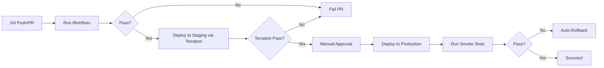

### **15.1 Why Test Infrastructure Code? (The Non-Negotiable Foundation)**

**Why This Matters More Than You Think:**  
Infrastructure-as-Code (IaC) isn't "just config." It's **executable software** that provisions multi-million dollar cloud environments. Untested IaC causes:
- **Catastrophic Outages:** A single syntax error can delete production databases (`terraform destroy` gone wrong).
- **Security Breaches:** Misconfigured S3 buckets (public!), overly permissive IAM roles.
- **Cost Explosions:** Unintended resource duplication, oversized instances.
- **Deployment Failures:** Breaking changes in modules causing pipeline failures at 3 AM.
- **Compliance Violations:** HIPAA/GDPR violations due to untested resource settings.

**The Testing Imperative:**
- **Shift Left on Reliability:** Catch errors *before* they hit production (like unit tests for apps).
- **Confidence in Automation:** Enable safe `terraform apply` in CI/CD pipelines.
- **Documentation via Tests:** Tests *are* executable specifications of expected behavior.
- **Cost of Failure:** Fixing infra errors post-deployment is **100x more expensive** than catching them in PR.
- **Team Trust:** Devs/ops trust the pipeline when tests pass – no more "works on my machine."

> 💡 **Key Insight:** *Not testing Terraform is like deploying untested banking software. The stakes are just as high (or higher).*

---

### **15.2 Unit Testing with tflint and tfsec (Static Analysis Powerhouse)**

**What It Is:**  
*Static analysis* – examining code **without execution**. Fast, cheap, runs in seconds during `git commit`.

#### **tflint: The Terraform Linter**
- **Purpose:** Enforces **best practices**, catches **syntax errors**, and validates **provider-specific rules**.
- **How It Works:**
  ```bash
  tflint --init          # Downloads plugins (AWS, Azure, GCP)
  tflint .               # Scans all .tf files in current dir
  ```
- **Critical Checks:**
  - `aws_db_instance_invalid_type`: Checks for invalid RDS instance types (e.g., `db.t3.micro` vs `db.t2.micro`).
  - `aws_s3_bucket_invalid_acl`: Flags deprecated ACLs like `authenticated-read`.
  - `terraform_deprecated_interpolation`: Catches legacy `${var.x}` syntax (use `var.x`).
  - **Custom Rules:** Define your own (e.g., "All S3 buckets must have `versioning` enabled").
- **Real-World Example:**
  ```hcl
  resource "aws_s3_bucket" "logs" {
    bucket = "my-logs"
    acl    = "public-read"  # tflint ERROR: acl "public-read" is not allowed
  }
  ```
- **Integration:** Runs in pre-commit hooks or PR checks. **Fails fast** on style/security issues.

#### **tfsec: The Security Scanner**
- **Purpose:** Finds **security misconfigurations** using **OWASP Top 10 for IaC** principles.
- **How It Works:**
  ```bash
  tfsec . --tfvars-file=prod.tfvars  # Scans with environment-specific vars
  ```
- **Critical Checks:**
  - `AWS001`: S3 bucket publicly accessible.
  - `AWS002`: IAM policy allows `*` privileges.
  - `AWS018`: RDS instance not encrypted at rest.
  - `AWS044`: EC2 instance with public IP and open SSH port.
- **How tfsec Thinks:**  
  It builds an **in-memory representation** of your Terraform plan, then applies rules like:  
  *"If `aws_s3_bucket` has `acl` containing `public` OR `policy` allowing `s3:GetObject` to `Principal: *`, FAIL."*
- **Custom Rules:** Extend with Rego (Open Policy Agent) for org-specific policies (e.g., "All resources must have `CostCenter` tag").

**Why Both?**  
- `tflint` = **Style & Validity** (Is the code *correct*?)  
- `tfsec` = **Security** (Is the code *safe*?)  
**→ Run both in every PR.**

> ⚠️ **Pitfall Alert:**  
> - tflint **won't catch** runtime errors (e.g., quota limits).  
> - tfsec **may miss** context-specific risks (e.g., "This bucket *should* be public for CDN"). Always review false positives.

---

### **15.3 Integration Testing with Terratest (Go-Based) (The Real Workhorse)**

**What It Is:**  
*Integration testing* – **deploying real infrastructure** in a test environment to validate behavior. Slow but **essential**.

#### **Why Go? Why Terratest?**
- **Cloud SDKs:** Go has first-class AWS/Azure/GCP SDKs (used by Terraform itself).
- **Concurrency:** Run tests in parallel (e.g., test 10 modules at once).
- **Maturity:** Largest IaC testing framework (by Gruntwork).

#### **Core Workflow:**
1. **Setup:** Spin up **real resources** in a test account (using Terraform).
2. **Validate:** Use Go to check if resources behave as expected.
3. **Teardown:** Destroy resources (even on test failure!).

#### **Key Terratest Patterns:**
```go
package test

import (
  "testing"
  "github.com/gruntwork-io/terratest/modules/terraform"
  "github.com/stretchr/testify/assert"
)

func TestS3BucketCreation(t *testing.T) {
  t.Parallel() // Run tests concurrently

  // 1. SETUP: Deploy Terraform
  terraformOptions := &terraform.Options{
    TerraformDir: "../examples/s3-bucket",
    Vars: map[string]interface{}{
      "bucket_name": "my-test-bucket-123",
    },
  }
  defer terraform.Destroy(t, terraformOptions) // Auto-cleanup!
  terraform.InitAndApply(t, terraformOptions)

  // 2. VALIDATE: Check AWS API
  bucketName := terraform.Output(t, terraformOptions, "bucket_name")
  exists := aws.S3BucketExists(t, "us-east-1", bucketName)
  assert.True(t, exists)

  // 3. VALIDATE: Check bucket properties
  versioning := aws.GetS3BucketVersioning(t, "us-east-1", bucketName)
  assert.Equal(t, "Enabled", versioning)
}
```

#### **Critical Capabilities:**
- **Test Real Outputs:** Validate `terraform output` values (e.g., `assert.Equal(t, "Enabled", versioning)`).
- **Check Resource Attributes:** Query cloud APIs directly (e.g., `aws.GetS3BucketVersioning`).
- **Handle Dependencies:** Test modules that depend on VPCs, IAM roles, etc.
- **Test Failure Scenarios:** Use `terraform.ApplyAndExpectError` to verify invalid configs fail.

#### **When to Use Terratest:**
- Validating **module outputs** (e.g., "Does this VPC module return correct private subnets?")
- Testing **cross-resource dependencies** (e.g., "Does an ALB route traffic to the EC2 instance?")
- **Security validation** beyond static analysis (e.g., "Can I *actually* SSH into the instance?")

> 💡 **Pro Tip:**  
> - Use **dedicated AWS test accounts** with budget alerts.  
> - Tag all test resources with `TerraformTest=true` for auto-cleanup.  
> - **Never run Terratest against production!**

---

### **15.4 Testing Modules in Isolation (The Secret to Reusable Modules)**

**Why Isolation is Non-Negotiable:**  
A module might work in *your* environment but fail in another due to:
- Missing dependencies (e.g., assumes a VPC exists)
- Hardcoded region/account IDs
- Undeclared outputs

#### **How to Test Modules in Isolation:**
1. **Create a `test` Directory:**  
   Inside your module repo:
   ```
   /my-module
     ├── main.tf
     ├── variables.tf
     ├── outputs.tf
     └── test/
         ├── fixture/
         │   ├── main.tf  # Minimal config to call module
         │   └── terraform.tfvars
         └── test_module.go  # Terratest file
   ```

2. **Fixture File (`test/fixture/main.tf`):**
   ```hcl
   module "test" {
     source = ".."  # Points to parent module
     bucket_name = "isolated-test-bucket"
     versioning_enabled = true
   }
   ```

3. **Terratest File (`test/test_module.go`):**
   ```go
   func TestModuleIsolation(t *testing.T) {
     terraformOptions := &terraform.Options{ 
       TerraformDir: "./fixture", // Uses the fixture
     }
     // ... (same as 15.3)
   }
   ```

#### **Critical Checks for Isolation:**
- **All inputs are passed explicitly** (no hardcoded values).
- **All required outputs are declared** (e.g., `module.test.bucket_arn` must exist).
- **No external dependencies** (e.g., doesn't assume `aws_vpc.default` exists).
- **Works in any region/account** (uses `var.region`, not `us-east-1`).

> 🔥 **Golden Rule:**  
> *"If your module can't pass tests in a completely empty AWS account, it's not reusable."*

---

### **15.5 Mocking Cloud APIs (Optional but Powerful)**

**Why Mock?**  
- Avoid **costs** from spinning up real resources.
- Test **edge cases** impossible in real clouds (e.g., "What if AWS returns `ThrottlingException` 10x?").
- **Speed:** Mocked tests run in **milliseconds**, not minutes.

#### **How to Mock (Using Go's `httpmock`):**
```go
import "github.com/jarcoal/httpmock"

func TestS3ErrorHandling(t *testing.T) {
  httpmock.Activate() // Intercept HTTP calls
  defer httpmock.DeactivateAndReset()

  // Mock AWS S3 API to return error
  httpmock.RegisterResponder(
    "PUT", "https://s3.amazonaws.com/my-bucket",
    httpmock.NewStringResponder(403, `{"Error": "AccessDenied"}`),
  )

  // Run Terraform apply (will fail)
  output := terraform.InitAndApplyAndReturnStdout(t, terraformOptions)
  assert.Contains(t, output, "Error: S3 API error")
}
```

#### **When to Mock:**
- Testing **retry logic** for throttled API calls.
- Validating **error handling** in custom providers.
- **Unit testing** Terraform *providers* (not common for end-users).

#### **When NOT to Mock:**
- For **integration tests** (you need real cloud behavior).
- If you care about **resource state** (mocks don't track state).

> ⚠️ **Reality Check:**  
> Mocking is **rarely used for standard Terraform testing**. Terratest's real-API approach is preferred for integration tests. Mock only when you need **deterministic failure simulation**.

---

### **15.6 Testing Outputs and Resource Attributes (The Validation Layer)**

**Why Outputs Matter:**  
Outputs are how modules communicate. If outputs are wrong, downstream modules break.

#### **Testing Strategies:**
1. **Validate Output Values Directly:**
   ```go
   bucketArn := terraform.Output(t, terraformOptions, "bucket_arn")
   assert.Regexp(t, `arn:aws:s3:::my-test-bucket-123`, bucketArn)
   ```

2. **Validate Resource Attributes via Cloud APIs (Terratest):**
   ```go
   // Check S3 bucket policy
   policy := aws.GetS3BucketPolicy(t, "us-east-1", bucketName)
   assert.Contains(t, policy, `"Action": "s3:GetObject"`)
   ```

3. **Validate Attributes in Plan (Pre-Apply):**
   ```bash
   terraform plan -out=tfplan
   terraform show -json tfplan > plan.json
   # Parse plan.json to check attributes (e.g., with jq)
   ```

#### **Critical Checks for Outputs:**
- **Existence:** Is the output defined? (`terraform.Output` panics if missing).
- **Correctness:** Does `vpc.private_subnets` contain *only* private subnets?
- **Consistency:** Do outputs match documentation? (Test your docs!).
- **Sensitivity:** Are sensitive outputs (passwords) marked `sensitive = true`?

#### **Advanced: Testing Dynamic Attributes**
- **EC2 Instance Types:** Verify `instance_type` matches input.
- **IAM Policy Documents:** Parse JSON to check for least privilege.
- **Network Configs:** Validate CIDR blocks don't overlap.

> 💡 **Pro Technique:**  
> Use `terraform output -json` in scripts to validate outputs in CI:  
> ```bash
> if ! jq -e '.bucket_arn | test("arn:aws:s3")' <<< $(terraform output -json); then
>   echo "Output validation failed!"
>   exit 1
> fi
> ```

---

### **15.7 End-to-End Testing in CI/CD (The Final Safety Net)**

**What is E2E Testing?**  
Validating the **entire system** – from Terraform apply to application deployment – in a **production-like environment**.

#### **CI/CD Pipeline Design:**


#### **Key Components:**
1. **Staging Environment:**  
   - **Must mirror production** (same region, account structure, network topology).  
   - Use **ephemeral environments** (destroy after test).

2. **Terratest in CI:**  
   ```yaml
   # .github/workflows/terraform.yml
   jobs:
     test:
       steps:
         - uses: hashicorp/setup-terraform@v1
         - run: cd test && go test -v -timeout 60m
       env:
         AWS_DEFAULT_REGION: us-east-1
         AWS_ACCESS_KEY_ID: ${{ secrets.TEST_AWS_ACCESS_KEY }}
         AWS_SECRET_ACCESS_KEY: ${{ secrets.TEST_AWS_SECRET_KEY }}
   ```

3. **E2E Test Types:**
   - **Smoke Tests:** Can I access the ALB? Does the DB accept connections?
   - **Conformance Tests:** Does the system meet compliance specs (e.g., "All logs go to CloudWatch")?
   - **Chaos Engineering:** Delete an instance – does autoscaling recover?

4. **Critical Safeguards:**
   - **Timeouts:** `go test -timeout 60m` (prevents zombie tests).
   - **Cost Controls:** Auto-destroy staging after 24h.
   - **Approval Gates:** Human check before prod deployment.
   - **Rollback Strategy:** `terraform apply -replace="aws_instance.broken"` or versioned deployments.

#### **Why E2E Testing is Non-Optional:**
- Catches **integration surprises** (e.g., "The module works alone, but breaks with the CDN module").
- Validates **real-world performance** (e.g., "Does the RDS instance handle load?").
- **Builds stakeholder confidence** – the last line of defense.

> 🌪️ **Disaster Prevention Tip:**  
> Run E2E tests against a **canary environment** that mirrors production but serves 0% traffic. Catch failures before users do.

---

### **Key Takeaways for Your Future Reference**

| **Test Type**       | **Tool**      | **Speed** | **Catches**                          | **Run In**       | **Critical For**               |
|---------------------|---------------|-----------|--------------------------------------|------------------|--------------------------------|
| **Static Analysis** | tflint, tfsec | Seconds   | Syntax, style, security flaws        | Pre-commit / PR  | Preventing low-hanging fruit   |
| **Unit Tests**      | Terratest     | Minutes   | Module isolation, output validation  | PR               | Reusable modules               |
| **Integration**     | Terratest     | 10-30 min | Resource interactions, cloud APIs    | PR / Staging     | Cross-module dependencies      |
| **E2E**             | Terratest + App Tests | 30+ min | System behavior, user journeys       | Staging / Prod   | Production confidence          |

**The Testing Pyramid for Terraform:**
```
          [E2E Tests]      (Few: 1-5 per service)
       [Integration Tests] (Moderate: 10-20 per module)
    [Static Analysis]      (Many: 100s per repo)
```
**→ Invert this pyramid, and your pipeline will be slow and flaky.**

**Golden Rules for Success:**
1. **Test Early, Test Often:** Run tflint/tfsec on every keystroke (VS Code plugins exist!).
2. **Isolate Tests:** Each module test must run independently.
3. **Destroy Everything:** Never leave test resources behind (use `defer` in Terratest).
4. **Test Outputs Religiously:** They're the contract between modules.
5. **E2E is Mandatory:** If you skip this, you're flying blind in production.

**Final Wisdom:**  
> *"Testing infrastructure code isn't about avoiding 'terraform apply' errors. It's about building **trust** in your automation. When your team merges a PR knowing the infrastructure will work – that's when DevOps becomes real."*
