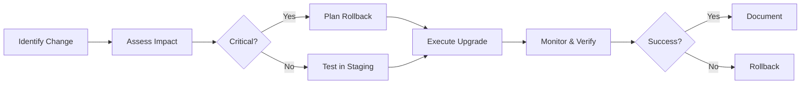

### **22.1 Terraform Version Management (tfenv)**
**Why it Matters:** Terraform versions evolve rapidly. Projects often require *specific* versions due to provider compatibility, syntax changes, or state file requirements. Manually switching versions is error-prone.

**What is tfenv?**  
`tfenv` is a **community-maintained version manager** (like `rbenv` for Ruby) that lets you:
- Install multiple Terraform versions side-by-side
- Switch versions per-directory or globally
- Pin versions via `.terraform-version` files

**Key Concepts & Workflow:**
1. **Installation** (OS-specific):
   ```bash
   # macOS (Homebrew)
   brew install tfenv

   # Linux (via git)
   git clone https://github.com/tfutils/tfenv.git ~/.tfenv
   echo 'export PATH="$HOME/.tfenv/bin:$PATH"' >> ~/.bashrc
   ```

2. **Core Commands:**
   ```bash
   tfenv list-remote       # Show all available versions
   tfenv install 1.5.7     # Install specific version
   tfenv use 1.5.7         # Set version for current shell
   tfenv use 1.6.0         # Switch to another version
   tfenv uninstall 0.14.11 # Remove a version
   ```

3. **Project-Specific Pinning (CRITICAL):**
   - Create `.terraform-version` in your project root:
     ```bash
     echo "1.5.7" > .terraform-version
     ```
   - When you `cd` into the directory, `tfenv` auto-switches to `1.5.7`.  
     *Why this matters:* Prevents "works on my machine" issues when teammates or CI systems use different versions.

4. **Advanced Features:**
   - `tfenv min-required`: Reads `required_version` from `terraform {}` block and sets `.terraform-version`.
   - `TFENV_TERRAFORM_VERSION`: Env var override for one-off commands.
   - Integration with CI/CD (e.g., GitHub Actions):
     ```yaml
     steps:
       - uses: hashicorp/setup-terraform@v3
         with:
           cli_config_credentials_token: ${{ secrets.TF_API_TOKEN }}
       - run: tfenv install
     ```

**Pitfalls to Avoid:**
- ❌ **Not pinning versions**: Causes silent failures when new Terraform versions break syntax.
- ❌ **Ignoring `.terraform-version` in CI**: CI might use a different default version.
- ✅ **Best Practice**: *Always* commit `.terraform-version` to source control.

---

### **22.2 Upgrading Terraform Versions**
**Why Upgrade?**  
- Security patches
- New features (e.g., `for_each`, cost estimation)
- Provider compatibility
- Bug fixes

**Step-by-Step Upgrade Process:**
1. **Check Current Version:**
   ```bash
   terraform version
   ```

2. **Review Release Notes:**  
   *Always* read [Terraform Changelog](https://github.com/hashicorp/terraform/blob/main/CHANGELOG.md) for:
   - Breaking changes (e.g., `0.12` removed `terraform refresh -module-depth`)
   - Deprecations (e.g., `0.13` deprecated `provider` blocks inside resources)
   - Critical bug fixes (e.g., state corruption fixes)

3. **Upgrade Safely:**
   ```bash
   # Using tfenv (recommended)
   tfenv install 1.6.0   # Download new version
   tfenv use 1.6.0       # Switch to it

   # Manual (not recommended for teams)
   wget https://releases.hashicorp.com/terraform/1.6.0/terraform_1.6.0_linux_amd64.zip
   unzip terraform_1.6.0_linux_amd64.zip -d /usr/local/bin
   ```

4. **Post-Upgrade Verification:**
   ```bash
   terraform validate    # Check config syntax
   terraform plan        # Verify no unexpected changes
   terraform state list  # Confirm state integrity
   ```

**Critical Rules:**
- **Never upgrade in production first!** Test in a staging environment.
- **Always backup state** before upgrading:
  ```bash
  terraform state pull > pre_upgrade_state.json
  ```
- Upgrade **one minor version at a time** (e.g., `1.5.0` → `1.5.1` → `1.5.2`), not major jumps.

---

### **22.3 Upgrading Provider Versions**
**Why Providers Matter:**  
Providers (e.g., `aws`, `azurerm`) are separate from Terraform core. Upgrading them unlocks new cloud features but may introduce breaking changes.

**Safe Upgrade Strategy:**
1. **Check Current Providers:**
   ```bash
   terraform providers
   # OR
   terraform providers lock -verify -platform=linux_amd64
   ```

2. **Review Provider Changelogs:**  
   Find changelogs at:
   - AWS: [registry.terraform.io/providers/hashicorp/aws/latest/docs#changelog](https://registry.terraform.io/providers/hashicorp/aws/latest/docs#changelog)
   - Azure: [registry.terraform.io/providers/hashicorp/azurerm/latest/docs#changelog](https://registry.terraform.io/providers/hashicorp/azurerm/latest/docs#changelog)

3. **Pin Versions in Config (MANDATORY):**
   ```hcl
   terraform {
     required_providers {
       aws = {
         source  = "hashicorp/aws"
         version = "~> 5.0" # Allows 5.0.x, blocks 6.0
       }
     }
   }
   ```
   - Use `~>` for safe minor/patch upgrades.
   - Avoid `latest` (causes uncontrolled breaks).

4. **Upgrade Process:**
   ```bash
   # 1. Update version constraint in config
   # 2. Run:
   terraform init -upgrade  # Re-downloads providers per new constraints
   terraform validate
   terraform plan           # CRITICAL: Check for unexpected diffs!
   ```

**Handling Breaking Changes:**
- If `plan` shows unexpected changes:
  - Consult provider changelog for migration guides (e.g., [AWS 5.0 Upgrade Guide](https://registry.terraform.io/providers/hashicorp/aws/latest/docs/guides/version-5-upgrade))
  - Modify configs to match new resource arguments
  - Example: AWS provider v4 → v5 renamed `aws_iam_role_policy` to `aws_iam_role_policy_document`

**Pitfall Alert:**  
Provider upgrades **can change state behavior**. Example:  
- `aws_iam_role` in v3.0 used `assume_role_policy` as string  
- v4.0+ requires `assume_role_policy` as JSON  
- **Result:** `terraform plan` shows *all IAM roles needing replacement!*  
  → **Fix:** Use `terraform state replace-provider` (covered in 22.6).

---

### **22.4 Migrating from Terraform 0.11 to 0.12+**
**Why This Migration is Critical:**  
Terraform 0.12 was a **massive rewrite** (HCL2 syntax). 0.11 configs *will not work* in 0.12+.  
*Note: 0.11 reached EOL in 2020 – no security updates.*

**Key Breaking Changes:**
| **0.11 Syntax**          | **0.12+ Syntax**               | **Why It Broke**                          |
|--------------------------|--------------------------------|-------------------------------------------|
| `"${var.foo}"`           | `var.foo`                      | Interpolation-only mode removed           |
| `list = ["a", "b"]`      | `list = ["a", "b"]` (no change) | **BUT** `list = ["a", "${var.b}"]` → `list = ["a", var.b]` |
| `count = "${var.instances}"` | `count = var.instances`      | Expressions everywhere                    |
| `resource "aws_instance" "web" {}` | Same, **but** | Dynamic blocks introduced                 |
| `module "vpc" { source = "..." }` | Same, **but** | Module inputs require explicit types      |
| `terraform_remote_state` | `data "terraform_remote_state" {}` | Changed from meta-argument to data source |

**Migration Steps:**
1. **Prerequisites:**
   - Terraform 0.11.15+ installed
   - State file backed up (`terraform state pull > state_011.json`)
   - No pending changes (`terraform apply` to clear plan)

2. **Run Automated Upgrader:**
   ```bash
   terraform 0.12upgrade
   ```
   - Creates backup files (`*.backup`)
   - Converts syntax automatically
   - **Does NOT fix all issues** (see below)

3. **Manual Fixes Required:**
   - **List/Tuple Conflicts:**  
     0.11 treated `["a"]` as list *or* tuple. 0.12 enforces type strictness.  
     → Fix: Explicitly cast: `tolist(["a"])`
   - **Dynamic Blocks:**  
     Replace `provisioner "file" { content = "${templatefile(...)}" }` with:
     ```hcl
     dynamic "provisioner" {
       for_each = [1]
       content {
         type    = "file"
         content = templatefile(...)
       }
     }
     ```
   - **Module Input Types:**  
     Add type hints in modules:
     ```hcl
     variable "subnets" {
       type = list(string) # Required in 0.12+
     }
     ```

4. **Validation & Testing:**
   ```bash
   terraform init      # Reinitialize with 0.12+
   terraform validate  # Will catch type errors
   terraform plan      # MUST show 0 changes!
   ```

**Critical Warning:**  
If `plan` shows resource replacements after migration:  
→ **DO NOT APPLY**  
→ Investigate with `terraform state show <resource>` to find drift.  
→ Common cause: Attribute name changes (e.g., `aws_instance` `subnet_id` → `subnet_id` became required).

---

### **22.5 Migrating from Terraform 0.14 to 1.x**
**Why Migrate?**  
- 0.14 reached EOL in Dec 2021
- 1.x introduced critical security fixes
- Better state locking, remote operations

**Key Changes from 0.14 → 1.0+:**
| **Area**                | **Change**                                                                 |
|-------------------------|----------------------------------------------------------------------------|
| **Version Constraint**  | `required_version = ">= 0.14, < 0.15"` → `required_version = ">= 1.0, < 2.0"` |
| **State File Format**   | Minor internal changes (handled automatically by `terraform init`)         |
| **Deprecations**        | `terraform remote config` (removed), `terraform graph -type=terraform` (removed) |
| **New Features**        | `moved` blocks, cost estimation, improved Sentinel policy checks           |
| **Provider Handling**   | Explicit provider source addresses required (e.g., `registry.terraform.io/hashicorp/aws`) |

**Migration Steps:**
1. **Pre-Upgrade Checks:**
   - Ensure Terraform 0.14.11+ is used (last 0.14 version)
   - Backup state: `terraform state pull > state_014.json`
   - Run `terraform validate` – must pass

2. **Upgrade Terraform Binary:**
   ```bash
   tfenv install 1.5.7
   tfenv use 1.5.7
   ```

3. **Reinitialize State:**
   ```bash
   terraform init
   ```
   - Terraform **automatically upgrades state format** to 1.x
   - *No manual intervention needed for state files*

4. **Critical Post-Upgrade Steps:**
   - **Update `required_version`:**
     ```hcl
     terraform {
       required_version = ">= 1.0, < 2.0"
     }
     ```
   - **Add Provider Source Addresses** (if missing):  
     In `required_providers`:
     ```hcl
     terraform {
       required_providers {
         aws = {
           source  = "hashicorp/aws" # Required in 1.0+
           version = "~> 5.0"
         }
       }
     }
     ```
   - **Replace Deprecated Commands:**
     - `terraform remote config` → Use [remote backend config](https://developer.hashicorp.com/terraform/language/settings/backends/remote)
     - `terraform graph -type=terraform` → Use `terraform graph | dot -Tsvg > graph.svg`

5. **Validation:**
   ```bash
   terraform validate
   terraform plan # MUST show 0 changes
   ```

**Pitfall Alert:**  
If you see `Error: Failed to query available provider packages`, it means:  
→ You forgot `source = "hashicorp/aws"` in provider config.  
→ **Fix:** Add explicit source addresses to *all* providers.

---

### **22.6 Breaking Changes & How to Handle Them**
**Why Breaking Changes Happen:**  
- Security vulnerabilities
- Fundamental design improvements
- Cloud API changes (via providers)
- Technical debt cleanup

**Handling Breaking Changes: Workflow**


**Step-by-Step Handling Guide:**

1. **Identify the Change:**
   - Read changelogs *before* upgrading
   - Monitor HashiCorp announcements (blog, GitHub releases)
   - Use `terraform providers lock -upgrade` to see potential breaks

2. **Assess Impact:**
   - Run `terraform plan` with new version **without applying**
   - Key questions:
     - Does it replace resources? (`-/+` in plan)
     - Does it change state behavior?
     - Does it require config rewrites?

3. **Critical Scenarios & Fixes:**

   **Scenario 1: State Incompatibility**  
   *Example:* Upgrading AWS provider v3 → v4 changed `aws_iam_role` state structure.  
   **Fix:** `terraform state replace-provider`  
   ```bash
   terraform state replace-provider \
     registry.terraform.io/-/aws \
     registry.terraform.io/hashicorp/aws
   ```
   - **How it works:** Rewrites state metadata without changing cloud resources.
   - **When to use:** After provider source address changes.

   **Scenario 2: Syntax Removal**  
   *Example:* Terraform 0.12 removed `${}` in top-level expressions.  
   **Fix:**  
   - Use `terraform 0.12upgrade` (for 0.11 → 0.12)
   - For newer versions: Manual config rewrite + `terraform validate`

   **Scenario 3: Resource Replacement**  
   *Example:* AWS provider v5 made `aws_security_group_rule`'s `self` attribute required.  
   **Fix:**  
   ```hcl
   # Before
   resource "aws_security_group_rule" "example" {
     type        = "ingress"
     cidr_blocks = ["0.0.0.0/0"]
   }

   # After (v5+)
   resource "aws_security_group_rule" "example" {
     type        = "ingress"
     cidr_blocks = ["0.0.0.0/0"]
     self        = false # Now required
   }
   ```
   - **Strategy:** Add missing attributes *before* upgrading provider.

   **Scenario 4: Deprecated Features**  
   *Example:* `terraform_remote_state` data source replaced meta-argument in 0.12.  
   **Fix:**  
   ```hcl
   # OLD (0.11)
   resource "aws_instance" "web" {
     vpc_id = "${terraform_remote_state.vpc.vpc_id}"
   }

   # NEW (0.12+)
   data "terraform_remote_state" "vpc" {
     backend = "s3"
     config = { bucket = "mybucket", key = "vpc.tfstate" }
   }

   resource "aws_instance" "web" {
     vpc_id = data.terraform_remote_state.vpc.outputs.vpc_id
   }
   ```

4. **Rollback Strategy (MUST HAVE):**
   - Keep old Terraform binary available (via `tfenv`)
   - Maintain pre-upgrade state backup
   - **Rollback steps:**
     ```bash
     tfenv use <old_version>
     terraform state push pre_upgrade_state.json
     terraform plan # Verify no drift
     ```

5. **Prevention Best Practices:**
   - Pin Terraform & provider versions strictly
   - Use `tfenv` with `.terraform-version`
   - Test upgrades in isolated environment
   - Implement CI pipeline with `terraform validate` and `terraform plan` checks
   - Monitor [Terraform Upgrade Guides](https://developer.hashicorp.com/terraform/guides/upgrading)

---

### **Critical Summary: Your Upgrade Survival Checklist**
| **Phase**       | **Action**                                                                 | **Tool/Command**                                  |
|-----------------|----------------------------------------------------------------------------|---------------------------------------------------|
| **Pre-Upgrade** | Backup state                                                               | `terraform state pull > state_backup.json`        |
|                 | Pin versions in config                                                     | `required_version`, `required_providers`          |
|                 | Read changelogs                                                            | [Terraform Changelog](https://github.com/hashicorp/terraform/blob/main/CHANGELOG.md) |
| **Upgrade**     | Use version manager                                                        | `tfenv install && tfenv use`                      |
|                 | Reinitialize                                                               | `terraform init -upgrade`                         |
| **Post-Upgrade**| Validate config                                                            | `terraform validate`                              |
|                 | Check for drift                                                            | `terraform plan` (MUST be 0 changes)              |
| **Rollback**    | Restore state                                                              | `tfenv use <old> && terraform state push backup`  |

**Golden Rule:**  
> **"If `terraform plan` shows unexpected changes after an upgrade, DO NOT APPLY. Investigate first."**
