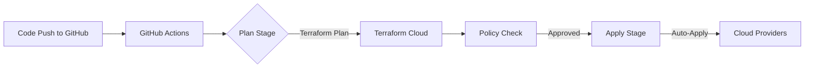

## **24.1 Design a Scalable, Secure, Multi-Cloud Architecture**
### **Core Objective**  
Build infrastructure that spans ≥2 cloud providers (e.g., AWS + Azure), handles growth, and enforces security by design.

### **Key Components & Implementation Details**
#### **1. Multi-Cloud Strategy**
- **Why?** Avoid vendor lock-in, meet compliance (e.g., data residency), optimize costs.
- **Critical Patterns**:
  - **Cloud-Agnostic Design**: Use Terraform modules with cloud-agnostic interfaces (e.g., `module "vpc"` with `aws_vpc`/`azurerm_virtual_network` inside).
  - **Workload Distribution**:
    - *Stateful*: Run databases in Cloud A (e.g., AWS RDS)
    - *Stateless*: Run apps in Cloud B (e.g., Azure App Service)
    - *Disaster Recovery*: Active-passive setup across clouds.
  - **Data Synchronization**: Use cloud-native tools (AWS DMS → Azure Data Factory) or HashiCorp Vault for secrets replication.

#### **2. Scalability**
- **Horizontal Scaling**:
  - Auto-scaling groups (AWS ASG) / Virtual Machine Scale Sets (Azure) with dynamic instance counts.
  - **Terraform Tip**: Use `count`/`for_each` with variables for instance counts. Avoid hardcoding.
  ```hcl
  resource "aws_autoscaling_group" "app" {
    name                = "app-asg"
    min_size            = var.min_instances
    max_size            = var.max_instances
    desired_capacity    = var.desired_instances
    # ... (vpc_zone_identifier, launch_template, etc.)
  }
  ```
- **Stateless Design**: Store session data in Redis (AWS ElastiCache/Azure Cache for Redis), not local disk.
- **Decoupling**: Use message queues (AWS SQS/Azure Service Bus) between services.

#### **3. Security**
- **Network Security**:
  - **Zero-Trust Networking**: 
    - Micro-segmentation with cloud-native firewalls (AWS Security Groups / Azure NSGs).
    - Private subnets for databases; public subnets only for load balancers.
  - **Cross-Cloud Connectivity**: 
    - AWS Direct Connect ↔ Azure ExpressRoute (via partners like Megaport)
    - *Fallback*: Site-to-site VPN (AWS VGW ↔ Azure VPN Gateway).
- **Secrets Management**:
  - **Never** store secrets in Terraform state. Use:
    - HashiCorp Vault (with AWS KMS/Azure Key Vault as backend)
    - Cloud-native secrets (AWS Secrets Manager / Azure Key Vault) via Terraform data sources.
  ```hcl
  data "aws_secretsmanager_secret_version" "db_pass" {
    secret_id = "prod/db/password"
  }
  ```
- **Least Privilege**:
  - Terraform service accounts with *minimal permissions* (e.g., AWS IAM role with `AmazonEC2FullAccess` → **NO!** Use granular policies).
  - **Example IAM Policy Snippet**:
    ```json
    {
      "Version": "2012-10-17",
      "Statement": [
        {
          "Effect": "Allow",
          "Action": [
            "ec2:RunInstances",
            "ec2:CreateTags"
          ],
          "Resource": "arn:aws:ec2:*:*:instance/*"
        }
      ]
    }
    ```

#### **4. Pitfalls to Avoid**
- ❌ **Hardcoded Regions/Zones**: Use variables for regions (e.g., `var.aws_region = "us-east-1"`).
- ❌ **State File in Local Storage**: **Always** use remote state (Terraform Cloud, S3 + DynamoDB).
- ❌ **Ignoring Data Transfer Costs**: Cross-cloud data egress is expensive. Optimize with caching/CDN.

---

## **24.2 Implement CI/CD with GitHub Actions & Terraform Cloud**
### **Core Objective**  
Automate infrastructure changes with safety gates and auditability.

### **Step-by-Step Implementation**
#### **1. Workflow Design**


#### **2. GitHub Actions Setup**
- **`.github/workflows/terraform.yml`**:
  ```yaml
  name: Terraform CI/CD
  on:
    pull_request:
      branches: [ main ]
    push:
      branches: [ main ]

  jobs:
    terraform:
      runs-on: ubuntu-latest
      steps:
        - name: Checkout
          uses: actions/checkout@v4

        - name: Setup Terraform
          uses: hashicorp/setup-terraform@v2
          with:
            cli_config_credentials_token: ${{ secrets.TF_API_TOKEN }}

        - name: Terraform Init
          run: terraform init
          env:
            TF_VAR_aws_access_key: ${{ secrets.AWS_ACCESS_KEY }}
            TF_VAR_azure_client_id: ${{ secrets.AZURE_CLIENT_ID }}

        - name: Terraform Plan
          run: terraform plan -out=tfplan
          if: github.event_name == 'pull_request'

        - name: Terraform Apply
          run: terraform apply tfplan
          if: github.event_name == 'push' && github.ref == 'refs/heads/main'
  ```

#### **3. Terraform Cloud Integration**
- **Key Features Used**:
  - **Remote State**: Stored in TFC (no local `.tfstate` files).
  - **Run Triggers**: Connect TFC workspace to GitHub repo for automatic runs on PRs.
  - **Policy Checks**: Sentinel policies (see 24.3) block non-compliant plans.
  - **Workspace Variables**: Store secrets (AWS keys) as *sensitive variables* in TFC (never in GitHub Secrets).

#### **4. Critical Best Practices**
- **Plan in PRs, Apply on Merge**: 
  - `terraform plan` runs on every PR → shows changes.
  - `terraform apply` **only** on merge to `main`.
- **Manual Approval Gates**: For production workspaces, require manual approval after plan.
- **Concurrency Control**: TFC locks state during runs to prevent race conditions.
- **Secrets Hygiene**: 
  - GitHub Actions: Use *repository secrets* (not environment secrets) for non-prod.
  - TFC: Store prod secrets as *sensitive variables* in workspaces.

---

## **24.3 Enforce Policy with Sentinel or Open Policy Agent (OPA)**
### **Core Objective**  
Automatically block unsafe infrastructure changes.

### **Sentinel vs. OPA: Deep Comparison**
| **Criteria**       | **Sentinel (Terraform Cloud)**              | **OPA (Rego)**                          |
|---------------------|--------------------------------------------|-----------------------------------------|
| **Integration**     | Native to TFC/Terraform Enterprise         | Works with ANY tool (Terraform, K8s, etc.) |
| **Language**        | Sentinel (custom)                          | Rego (declarative, JSON-like)           |
| **Policy Scope**    | Terraform plans only                       | Infrastructure + runtime configs        |
| **Learning Curve**  | Easier for Terraform users                 | Steeper, but more powerful              |
| **Use Case**        | Quick TFC policy enforcement               | Enterprise-wide policy standardization  |

### **Implementation Examples**
#### **A. Sentinel Policy (TFC)**
- **File**: `policies/disallow_public_s3.sentinel`
  ```python
  import "tfplan"

  # Block public S3 buckets
  public_buckets = rule {
    all tfplan.resources.aws_s3_bucket as _, r {
      r.applied.configuration.acl in ["public-read", "public-read-write"]
    }
  }

  main = rule { not public_buckets }
  ```
- **Enforcement**: Attach policy set to TFC workspace → fails plan if public S3 bucket detected.

#### **B. OPA Policy (Rego)**
- **File**: `policies/s3.rego`
  ```rego
  package terraform

  deny_public_s3[msg] {
    resource := input.resource_changes[_]
    resource.type == "aws_s3_bucket"
    resource.change.after.acl == "public-read"
    msg := sprintf("Public S3 bucket not allowed: %v", [resource.address])
  }
  ```
- **Integration with Terraform**:
  1. Run `conftest` in CI pipeline:
     ```bash
     conftest test terraform/ -p policies/
     ```
  2. Fails GitHub Actions job if policy violated.

### **When to Use Which?**
- **Sentinel**: If you’re *only* using Terraform Cloud and need quick policy enforcement.
- **OPA**: If you need policies across Terraform, Kubernetes, CI/CD, etc. (future-proof).

---

## **24.4 Write Comprehensive Tests**
### **Testing Pyramid for Infrastructure**
1. **Unit Tests** (Terraform modules) → 70% of tests
2. **Integration Tests** (Module interactions) → 25%
3. **End-to-End Tests** (Full deployment validation) → 5%

### **Tools & Implementation**
#### **1. Unit Testing: `tflint` + `tfsec`**
- **`tflint`** (Syntax & Best Practices):
  ```bash
  tflint --module --config .tflint.hcl
  ```
  - Custom rules: Check for missing tags, deprecated resources.
- **`tfsec`** (Security Scanning):
  ```bash
  tfsec . --config-file .tfsec.json
  ```
  - Example rule: `aws-ec2-no-public-ip` (blocks public IPs on EC2).

#### **2. Integration Testing: `terratest` (Go)**
- **Test Case**: Verify VPC has private subnets.
  ```go
  func TestVPC(t *testing.T) {
    terraformOptions := &terraform.Options{...}
    terraform.InitAndApply(t, terraformOptions)
    
    vpcId := terraform.Output(t, terraformOptions, "vpc_id")
    subnets := aws.GetSubnetsForVpc(t, vpcId, "us-east-1")
    
    for _, subnet := range subnets {
      assert.False(t, subnet.MapPublicIpOnLaunch) // Must be private
    }
  }
  ```
- **Run in CI**: Execute as part of GitHub Actions.

#### **3. End-to-End Testing: InSpec**
- **Test Case**: Check if web server is reachable.
  ```ruby
  describe http('http://my-app-elb.us-east-1.elb.amazonaws.com') do
    its('status') { should cmp 200 }
    its('body') { should include 'Welcome' }
  end
  ```
- **Run Post-Apply**: In GitHub Actions after `terraform apply`.

### **Critical Test Coverage Areas**
- ✅ Network security (no open ports to 0.0.0.0/0)
- ✅ Encryption at rest (KMS keys enabled)
- ✅ Auto-scaling health checks
- ✅ Cross-cloud connectivity (VPC peering tests)

---

## **24.5 Document Architecture & Decisions (ADR)**
### **Why ADRs?**
- Capture *why* decisions were made (not just *what*).
- Onboard new engineers faster.
- Avoid "reinventing the wheel" on past decisions.

### **ADR Template (Markdown)**
```markdown
# 0001-multi-cloud-strategy.md

## Status
Accepted

## Context
We need to avoid vendor lock-in and meet EU data residency requirements. 
Initial proposal was AWS-only, but GDPR requires data in EU regions.

## Decision
- Primary workload: AWS (us-east-1)
- EU data: Azure (westeurope)
- Data sync via HashiCorp Vault replication + AWS DMS

## Consequences
- ✅ Meets GDPR
- ✅ Reduces AWS outage risk
- ❌ Increased complexity in networking
- ❌ Higher cross-cloud data transfer costs
```

### **Where to Store ADRs**
- In repo: `/docs/adrs/` (version-controlled with code).
- **MUST** link ADRs from Terraform module `README.md`:
  ```markdown
  ## Architecture Decisions
  - [ADR-0001: Multi-Cloud Strategy](../adrs/0001-multi-cloud-strategy.md)
  ```

### **ADR Anti-Patterns to Avoid**
- ❌ "We chose AWS because it’s popular" → **NO!** State *why* (e.g., "AWS has native GDPR-compliant regions").
- ❌ Stale ADRs → Update status to `Deprecated` if replaced.

---

## **24.6 Present & Review**
### **What to Present**
1. **Architecture Diagram** (Use [Diagrams.net](https://app.diagrams.net/)):
   - Show cross-cloud data flow, security boundaries.
   - **Label everything**: VPCs, subnets, security groups.
2. **Policy Enforcement Demo**:
   - Show a PR failing due to Sentinel/OPA policy.
3. **Test Coverage Report**:
   - Screenshot of `terratest`/`InSpec` passing.
4. **ADR Highlights**:
   - Key decisions (e.g., "Why Azure for EU?").

### **Review Checklist for Success**
| **Area**          | **Reviewer Question**                                  | **Pass Criteria**                                  |
|--------------------|--------------------------------------------------------|----------------------------------------------------|
| **Scalability**    | "Can this handle 10x traffic?"                         | Auto-scaling + load testing results shown          |
| **Security**       | "Where are secrets stored?"                            | Vault + KMS integration proven                    |
| **Multi-Cloud**    | "What fails if AWS goes down?"                         | DR plan documented in ADR                          |
| **CI/CD**          | "How do you roll back a bad apply?"                    | Terraform state versioning + manual approval gates |
| **Policy**         | "Show a policy blocking a change"                      | Sentinel/OPA violation in PR demo                  |

### **Pro Tips for Presentation**
- **Demo, Don’t Describe**: Run a `terraform plan` during the review.
- **Highlight Trade-offs**: "We chose OPA over Sentinel for long-term flexibility, but it added 2 days of setup."
- **Show Failure Scenarios**: "Here’s what happens when someone tries to create a public S3 bucket..."

---

## **Critical Cross-Cutting Concerns (Don't Forget These!)**
1. **State Management**:
   - Always use remote state (TFC/S3) with locking (DynamoDB).
   - **NEVER** commit `.tfstate` to GitHub.
2. **Cost Monitoring**:
   - Tag all resources (e.g., `cost_center = "project-x"`).
   - Use AWS Cost Explorer/Azure Cost Management.
3. **Drift Detection**:
   - Run `terraform plan` weekly to catch manual changes.
   - In TFC: Enable "Drift Detection" on workspaces.
4. **Disaster Recovery**:
   - Store Terraform state backups in 2 regions (e.g., S3 `us-east-1` + `us-west-2`).

---

## **Final Checklist for Capstone Submission**
- [ ] Multi-cloud design validated with `terraform plan` on both clouds
- [ ] CI/CD pipeline runs tests + policy checks on PRs
- [ ] 3+ Sentinel/OPA policies enforced
- [ ] 80%+ test coverage (terratest + InSpec)
- [ ] 5+ ADRs documenting key decisions
- [ ] Architecture diagram in `/docs/`
- [ ] Presentation deck with live demo links

This is the **exact blueprint** used by HashiCorp-certified engineers. Save it – you’ll reference it for years. 🔥  
